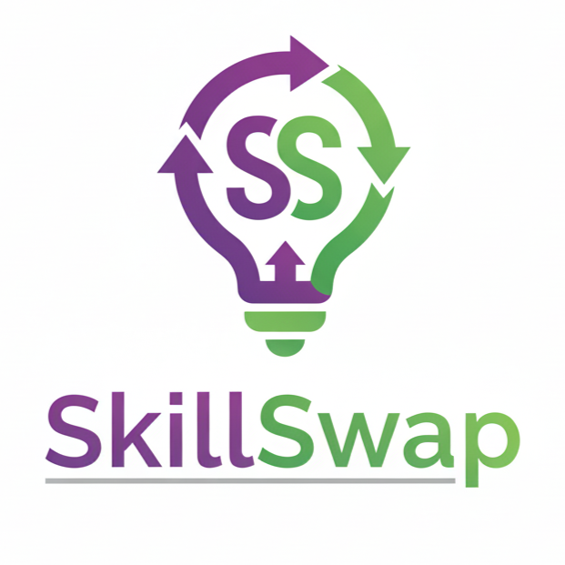

# SkillSwap — Trade Skills Without Money

<p align="center">
  
</p>

<p align="center">
  <strong>A barter-only skill marketplace where users trade skills without money.</strong>
</p>

<p align="center">
  
  
  
  
</p>

<p align="center">
  <a href="#features">Features</a> •
  <a href="#tech-stack">Tech Stack</a> •
  <a href="#getting-started">Getting Started</a> •
  <a href="#project-structure">Structure</a> •
  <a href="#api-documentation">API</a> •
  <a href="#contributing">Contributing</a>
</p>

---

## Overview

SkillSwap is a modern web application that enables users to exchange skills and services through a barter system. Instead of using money, users trade their expertise directly with others or use an internal credit system called **SkillCoins**.

### Core Concept

- **Post Skill Offers**: Share what you can teach or do
- **Post Skill Requests**: Describe what you want to learn or get done
- **Propose Barter Deals**: Trade skills directly (e.g., "I'll teach Python if you design my poster")
- **Earn SkillCoins**: Build credits by completing tasks
- **Build Trust**: Grow your reputation through ratings and reviews

---

## Features

### For Users
- **Skill Offers & Requests** - List skills you offer and want
- **Barter Deals** - Propose and negotiate skill trades
- **SkillCoins** - Internal credit system for flexibility
- **Trust Score** - Reputation based on ratings and history
- **Messaging** - In-app chat for deal discussions
- **Notifications** - Stay updated on proposals and messages
- **User Profiles** - Showcase your skills and reviews

### For Admins
- **User Management** - View and moderate users
- **Dashboard** - Overview of platform activity
- **Dispute Resolution** - Handle reported issues
- **Content Moderation** - Remove inappropriate content

---

## 🛠 Tech Stack

### Frontend
- **React.js** - UI library
- **React Router** - Client-side routing
- **Framer Motion** - Smooth animations
- **Axios** - HTTP client
- **CSS Modules** - Scoped styling

### Backend
- **Node.js** - Runtime environment
- **Express.js** - Web framework
- **MongoDB** - Database
- **Mongoose** - ODM for MongoDB
- **JWT** - Authentication
- **bcrypt** - Password hashing
- **Multer** - File uploads

---

## Getting Started

### Prerequisites

- **Node.js** (v18 or higher)
- **MongoDB** (local or Atlas)
- **npm** or **yarn**

### Installation

1. **Clone the repository**
   ```bash
   git clone https://github.com/ZenYukti/SkillSwap.git
   cd SkillSwap
   ```

2. **Install all dependencies**
   ```bash
   npm run install:all
   ```

3. **Set up environment variables**
   
   Copy the example env file and update values:
   ```bash
   cp .env.example server/.env
   ```
   
   Edit `server/.env` with your configuration:
   ```env
   MONGODB_URI=mongodb://localhost:27017/skillswap
   JWT_SECRET=your_secure_secret_key
   JWT_REFRESH_SECRET=your_refresh_secret_key
   CLIENT_URL=http://localhost:5173
   ```

4. **Start MongoDB** (if running locally)
   ```bash
   mongod
   ```

5. **Run the application**
   ```bash
   # Run both frontend and backend
   npm run dev
   
   # Or run separately:
   npm run server  # Backend on port 5000
   npm run client  # Frontend on port 5173
   ```

6. **Open in browser**
   ```
   http://localhost:5173
   ```

### Creating an Admin User

Run the seed script to create a default admin:
```bash
cd server
npm run seed:admin
```

Default admin credentials:
- Email: `admin@skillswap.com`
- Password: `Admin123!`

---

## Project Structure

```
SkillSwap/
├── client/                 # React frontend
│   ├── public/            # Static assets
│   └── src/
│       ├── components/    # Reusable UI components
│       ├── pages/         # Page components
│       ├── context/       # React Context providers
│       ├── services/      # API service functions
│       ├── hooks/         # Custom React hooks
│       ├── styles/        # Global styles and CSS modules
│       └── utils/         # Utility functions
│
├── server/                 # Node.js backend
│   ├── config/            # Configuration files
│   ├── controllers/       # Route controllers
│   ├── middleware/        # Custom middleware
│   ├── models/            # Mongoose models
│   ├── routes/            # API routes
│   ├── utils/             # Utility functions
│   ├── uploads/           # File uploads directory
│   └── tests/             # Backend tests
│
├── .env.example           # Environment variables template
├── package.json           # Root package.json
└── README.md              # This file
```

---

## 🔌 API Documentation

### Base URL
```
http://localhost:5000/api
```

### Authentication
| Method | Endpoint | Description |
|--------|----------|-------------|
| POST | `/auth/register` | Register new user |
| POST | `/auth/login` | Login user |
| POST | `/auth/refresh` | Refresh access token |
| POST | `/auth/logout` | Logout user |
| POST | `/auth/forgot-password` | Request password reset |

### Users
| Method | Endpoint | Description |
|--------|----------|-------------|
| GET | `/users/me` | Get current user |
| PUT | `/users/me` | Update profile |
| GET | `/users/:username` | Get public profile |
| PUT | `/users/password` | Change password |

### Skills
| Method | Endpoint | Description |
|--------|----------|-------------|
| GET | `/skills` | Get all skills (with filters) |
| POST | `/skills/offer` | Create skill offer |
| POST | `/skills/request` | Create skill request |
| GET | `/skills/:id` | Get skill details |
| PUT | `/skills/:id` | Update skill |
| DELETE | `/skills/:id` | Delete skill |

### Deals
| Method | Endpoint | Description |
|--------|----------|-------------|
| GET | `/deals` | Get user's deals |
| POST | `/deals` | Create barter proposal |
| GET | `/deals/:id` | Get deal details |
| PUT | `/deals/:id/status` | Update deal status |
| POST | `/deals/:id/review` | Add review |

### Messages
| Method | Endpoint | Description |
|--------|----------|-------------|
| GET | `/messages/conversations` | Get conversations |
| GET | `/messages/:conversationId` | Get messages |
| POST | `/messages` | Send message |

### Notifications
| Method | Endpoint | Description |
|--------|----------|-------------|
| GET | `/notifications` | Get notifications |
| PUT | `/notifications/:id/read` | Mark as read |
| PUT | `/notifications/read-all` | Mark all as read |

---

## Testing

```bash
# Run all tests
npm test

# Run backend tests only
cd server && npm test

# Run frontend tests only
cd client && npm test
```

---

## Design Philosophy

SkillSwap follows a modern, clean design approach:

- **Light Theme** - Easy on the eyes
- **Smooth Animations** - Framer Motion for delightful interactions
- **Responsive** - Mobile-first design
- **Accessible** - WCAG guidelines compliance
- **Minimal** - Focus on content and functionality

---

## Contributing

We welcome contributions! Please see our [Contributing Guide](CONTRIBUTING.md) for details.

1. Fork the repository
2. Create your feature branch (`git checkout -b feature/amazing-feature`)
3. Commit your changes (`git commit -m 'feat: add amazing feature'`)
4. Push to the branch (`git push origin feature/amazing-feature`)
5. Open a Pull Request

---

## License

This project is licensed under the MIT License - see the [LICENSE](LICENSE) file for details.

---

## Acknowledgments

- Built with ❤️ by [Team ZenYukti](https://zenyukti.in)
- Inspired by the philosophy of skill sharing and community collaboration
- "Learn. Build. Share." — To grow together

---

## Team ZenYukti

| | |
|---|---|
| **Website** | [zenyukti.in](https://zenyukti.in) |
| **LinkedIn** | [linkedin.com/company/ZenYukti](https://linkedin.com/company/ZenYukti) |
| **Twitter/X** | [x.com/ZenYukti](https://x.com/ZenYukti) |
| **Discord** | [Join our community](https://go.zenyukti.in/discord) |
| **Email** | [info@zenyukti.in](mailto:info@zenyukti.in) |
| **Support** | [support@zenyukti.in](mailto:support@zenyukti.in) |

---

<p align="center">
  <strong>SkillSwap</strong> — Trade Skills, Not Money
  <br><br>
  <em>"Learn. Build. Share."</em> — Team ZenYukti 💜
</p>
